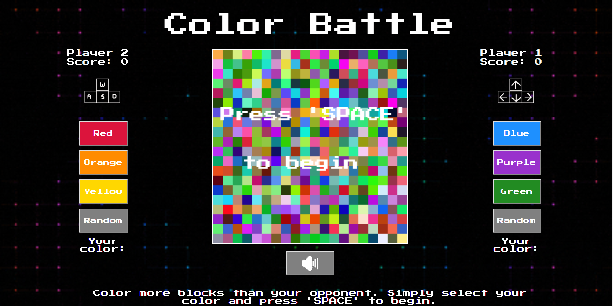

#Color Battle

##A Simple VS. Game Color Battle takes its inspiration in the very first homeconsoles and arcades, blocky graphics and
biright colors acompany you in simple but addicting gameplay. In this game of skill and wits, you and your best friend,
or worst enemy, pick colors and battle it out for the control of the 100 blocks in the game board. A count down and
music that gets slightly more frantic the closer you are to the end add to your sense of urgency for victory.

##Easy to play The controls are easy to pick up so you can instantly be competitive. The Arrow keys move Player 1 while
the keys 'WASD' give Player 2 all the mobility a 2 dimiensional block could wish for.

##Features *Pick Your own Colors wether it is from the pre-selected range or completely up to fate. *Mute button so that
your 1000th game doesn't drive you nuts *Live Scores so there is never a confusion about the winner *A Conan the
Barbarian easter egg for those who manage to trounce their competiton in a truly barbaric fashion
